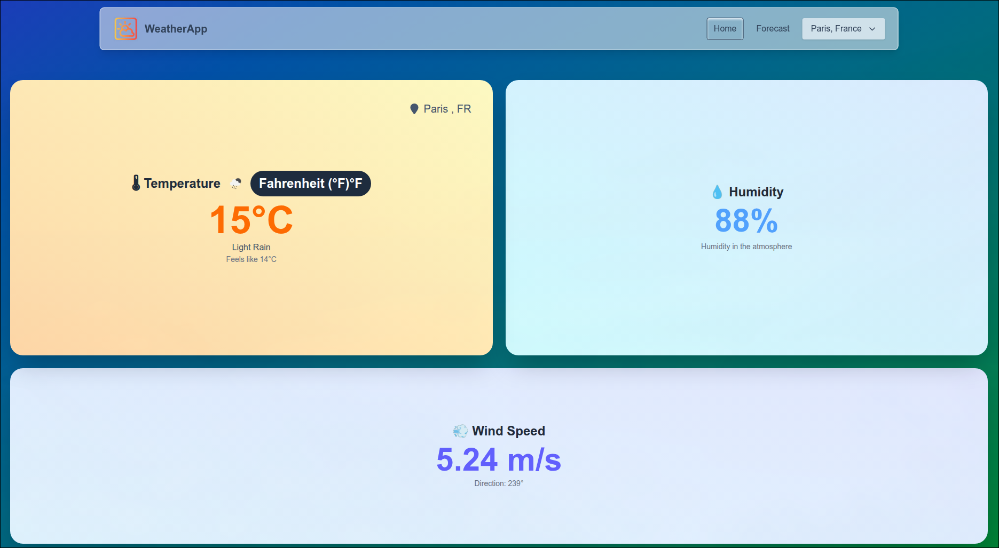
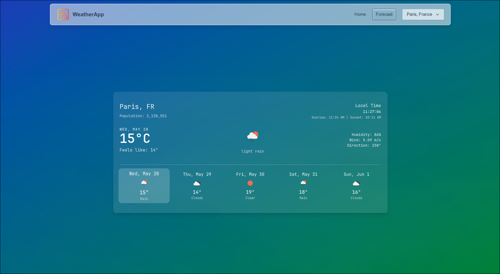

# 🌦️ React Weather Dashboard

A modern and responsive weather dashboard built using **React.js**, integrated with the **OpenWeatherMap API**. This app allows users to search for any city to get real-time weather data with features like auto-refresh, local storage, and state management.

---

## 📸 Demo Screenshots


| Home Page              | Weather Details View       |
|------------------------|----------------------------|
|  |  |

---

## 🚀 Features

- 🔍 **City Search** for real-time weather
- 🌡️ Temperature, Humidity, Wind Speed, and Conditions
- 🌦️ Dynamic weather icons
- ♻️ **API Polling** every 30 seconds
- 💾 **Local Storage** support for last searched city
- 🧩 **Component Modularization**
- 🧠 **Redux Toolkit** for state management
- 🛠️ Error handling with user-friendly messages

---

## 🔧 Tech Stack

- **React** (with Hooks)
- **Redux Toolkit**
- **React Router DOM**
- **OpenWeatherMap API**
- **Tailwind CSS** (or replace with CSS Modules / Styled Components)
- **Vite** (faster build)

---

## 📦 Installation & Setup

```bash
# Clone the repository
git clone https://github.com/ShivShankarKushwaha/weather-report.git

# Navigate into the directory
cd weather-report

# Install dependencies
npm install

# Start the development server
npm run dev
```

> Make sure to add your OpenWeatherMap API key in `.env`:

```env
VITE_WEATHER_API_KEY=your_api_key_here
```

---

## ⚙️ Usage

- Type a city in the search bar to get weather details
- Click on "Use Current Location" to get weather for your geolocation
- Revisit the app to see the last searched city’s weather

---

## 🧪 API Polling

The weather data auto-refreshes every 30 seconds using `setInterval` inside a `useEffect` hook to demonstrate polling for real-time updates.

---

## 🛑 Error Handling

Handles:
- Invalid city names
- Network failures
- API rate limits

Shows user-friendly alerts or banners without breaking the UI.

---

## 💡 Bonus Features (Optional)

- [x] 5-Day Forecast
- [x] Toggle between Celsius / Fahrenheit
- [x] React Query (or SWR) support (optional)

---

## 📜 Submission Instructions

```
Frontend Developer Assignment
```

**To:** `kavya@qodex.ai`
**Cc:** `siddhant@qodex.ai`

---

## 📖 License

This project is for assignment submission purposes. Feel free to use the architecture or features in other personal projects.
